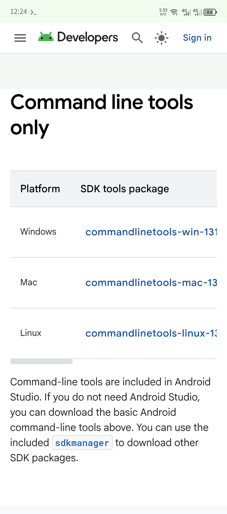
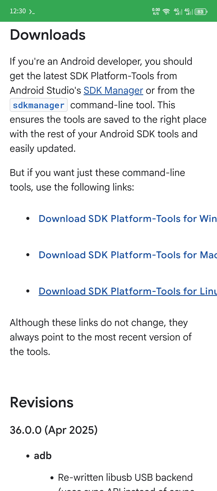

# Build Android App on [Termux](https://termux.dev/en/) 🧰

&emsp;&emsp;Let build Android Studio Project on Termux App using Gradle.

## Requirements 🛠️

* [Android SDK Command Line Tools](https://developer.android.com/tools#tools-sdk)
* [Android SDK Platform Tools](https://developer.android.com/tools#tools-platform)
* [Gradle Build Tool](https://gradle.org/)
* AAPT2 (arm64 or your device architecture binaries for Android) ***(Required if build-in aapt2 didn't support arm64)***
* Don't forget to install JDK in your Termux. To install JDK on Termux `pkg install openjdk-17`

## Note 📝

&emsp;&emsp;While building Android App from [Termux](https://termux.dev/en/), complieSDK and targetSDK are 34. Setting it to greater than 34. It will fail the build of the App. I still didn't find the way to fix it yet. Build-in aapt2 support it respective SDK(34, 35, 36). But it doesn't support arm64. So, it can't be used in Termux. The aapt2 from Termux wasn't latest. So, it doesn't support latest SDK 35 and 36. 

### Download Required Tools ⬇️

Download Android SDK Command Line Tools from [here](https://developer.android.com/studio#command-tools). Download the Linux one.


Download Android SDK Platform Tools from [here](https://developer.android.com/tools/releases/platform-tools). [Direct link](https://dl.google.com/android/repository/platform-tools-latest-linux.zip) Download the Linux.


Download Gradle Build Tools from [here](https://gradle.org/releases/). Download `binary-only` or `complete`.


##### For aapt2

You can install it with `pkg` or `apt`.
```bash
pkg install aapt2
# or 
apt install aapt2
```

### Extract the tools

&emsp;&emsp; Extract tools to their respective directories.
Create directories if not exist.

```bash
mkdir -p $HOME/Android/SDK
mkdir -p $PREFIX/opt/gradle
```
Go to downloaded zip directory.

##### Extract android cmdline-tools.
Change cmdline.zip with your file name.
```bash
unzip cmdline.zip -d $HOME/Android/Sdk/latest
```

##### Extract platform tools.
Change platform-tool.zip with your file name.
```bash
unzip platform-tool.zip -d $HOME/Android/Sdk/
```

##### Extract gradle.
Change file name with your downloaded file name. E.g. `gradle-8.14.1-all.zip`.
```bash
unzip gradle-x.x.x-(all or bin).zip -d $$PREFIX/opt/gradle/
```

## Setting up Environment

To export PATH add it to .bashrc or your shell's config file.
```bash
export ANDROID_HOME=$HOME/Android/Sdk
export GRADLE_HOME=$PREFIX/opt/gradle
export PATH=$PATH:ANDROID_HOME/cmdline-tools/latest/bin:$GRADLE_HOME/<Gradle version>/bin
```
replace \<gradle version\> with your downloaded grade. E.g. `gradle-8.14.1`

Load the file with 
```bash
source .bashrc
```

Add Android SDK directory to your project.
```bash
cd project-dir
echo "sdk.dir=$ANDROID_HOME" > local.properties
```

Test to check does everything work.

```bash
# check gradle 
gradle -v
# check commandline-tools
sdkmanager --version
```

Then, try executing your project gradlew file. E.g. `gradlew tasks`.

#### For aapt2
&emsp;&emsp;If build-in aapt2 don't work. Use aapt2 install by Termux. Just add this line `android.aapt2FromMavenOverride=/data/data/com.termux/files/usr/bin/aapt2`
to `gradle.properties` file. That file exists at root of your project directory.
